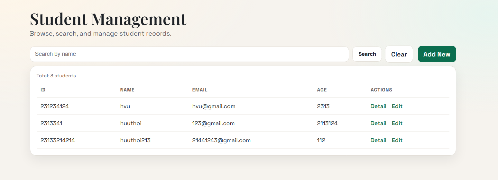
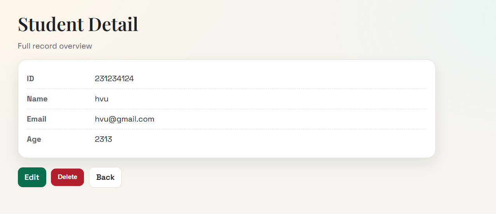
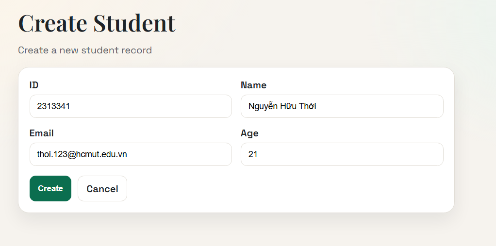
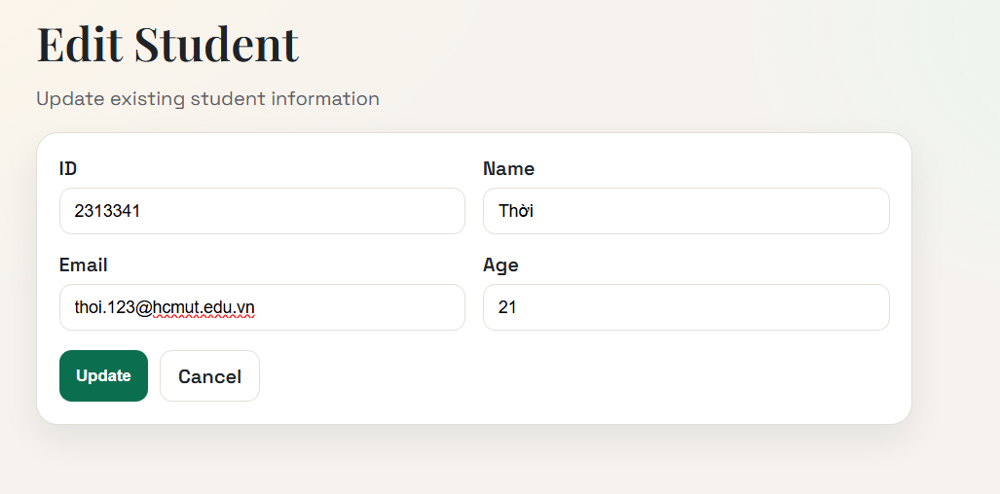

# Danh sách thành viên nhóm
| Họ và tên       | MSSV    |
|-----------------|---------|
| Nguyễn Hữu Thời | 2313341 |
| Lâm Hoàng Vũ    | 2313953|
# 🌐 Public URL của Web Service
🔗 **https://student-management-lab-wa0z.onrender.com/students**

# Hướng dẫn cách chạy dự án
## Yêu cầu
- JDK 17
- Maven (hoặc dùng `mvnw`/`mvnw.cmd`)
- PostgreSQL

## Cấu hình môi trường
1. Cập nhật file `.env` phù hợp với máy của bạn (host/port/user/password và tên database).
2. Tạo database `student_management` trong PostgreSQL (hoặc đổi tên theo `POSTGRES_DB`).

Mẫu `.env`:
```properties
POSTGRES_HOST=localhost
POSTGRES_PORT=5432
POSTGRES_DB=student_management
POSTGRES_USER=postgres
POSTGRES_PASSWORD=123456

SPRING_DATASOURCE_URL=jdbc:postgresql://${POSTGRES_HOST}:${POSTGRES_PORT}/${POSTGRES_DB}
SPRING_DATASOURCE_USERNAME=${POSTGRES_USER}
SPRING_DATASOURCE_PASSWORD=${POSTGRES_PASSWORD}
SPRING_JPA_DATABASE_PLATFORM=org.hibernate.dialect.PostgreSQLDialect
SPRING_JPA_HIBERNATE_DDL_AUTO=update

PORT=8080
```

## Chạy ứng dụng
1. `./mvnw spring-boot:run`
2. Mặc định ứng dụng chạy ở `http://localhost:8080`.

## Build jar (tùy chọn)
1. `mvnw.cmd -DskipTests package` (Windows) hoặc `./mvnw -DskipTests package` (macOS/Linux)
2. `java -jar target/*.jar`

# Trả lời câu hỏi lý thuyết 
## LAB 1
### 1. Tạo ít nhất 10 sinh viên nữa
Script: 
```declarative
INSERT INTO students (id, name, email, age) VALUES
(3, 'Nguyễn Minh Anh', 'minhanh03@example.com', 20),
(4, 'Trần Hoàng Nam', 'hoangnam04@example.com', 21),
(5, 'Lê Thu Hà', 'thuha05@example.com', 19),
(6, 'Phạm Quang Huy', 'quanghuy06@example.com', 22),
(7, 'Hoàng Gia Bảo', 'giabao07@example.com', 20),
(8, 'Võ Thị Ngọc Trâm', 'ngoctram08@example.com', 21),
(9, 'Đặng Thanh Tùng', 'thanhtung09@example.com', 20),
(10, 'Bùi Khánh Linh', 'khanhlinh10@example.com', 23),
(11, 'Đỗ Anh Tuấn', 'anhtuan11@example.com', 19),
(12, 'Nguyễn Hữu Phúc', 'huuphuc12@example.com', 22),
(13, 'Phan Thị Mỹ Duyên', 'myduyen13@example.com', 21),
(14, 'Trương Công Minh', 'congminh14@example.com', 20);
```
### 2. Ràng buộc khoá chính
Database chặn thao tác khi insert 1 sinh viên có trùng id vì trường id của bảng `student` được định nghĩa là Primary Key.
### 3. Toàn vẹn dữ liệu
Khi thực thi câu lệnh: 
``` 
INSERT INTO students (id, name, email, age) VALUES (15, NULL, 'vana@example.com', 20);
```
Database không báo lỗi.

Khi code Java đọc dữ liệu lên, vì name là NULL nên khi trường name được sử dụng, nó sẽ gây ra lỗi `NULLPOINTEREXCEPTION`.

### 4. Cấu hình Hibernate
Khi mỗi lần tắt ứng dụng và chạy lại, dữ liệu mất hết vì chúng ta đã cấu hình trong file `.properties` là `ddl-auto=create`, tức là mỗi lần khởi chạy lại ứng dụng, hibernate sẽ tự động xoá và tạo lại bảng.

#LAB 4
## MODULE Trang Danh Sách

## MODULE Trang Chi Tiết

## MODULE Chức năng Thêm & Sửa
### Thêm

### Sửa

